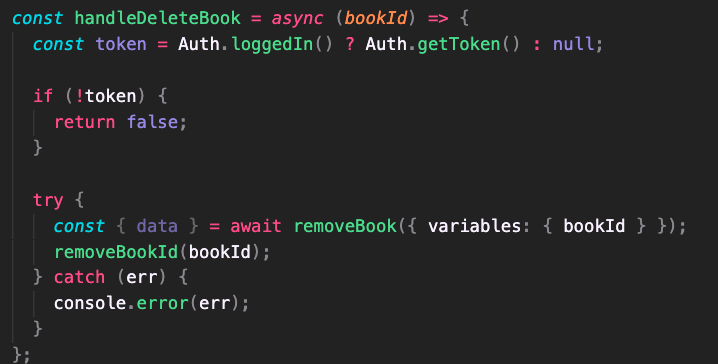

# Google Book Search Engine

## License

This repo is licensed by MIT

[](https://opensource.org/licenses/MIT)

## Description

Using MongoDB, Express, Node.JS, Apollo as a wrapper for GraphQL, and React, a user can search for books. As a logged in user, a user can save books, look through saved books, and remove books from that list.

## Table of Contents

- [Installation](#installation)
- [Technologies](#technologies)
- [Deployed Link](#deployed%20link)
- [Usage](#usage)
- [Credits](#credits)
- [Tests](#tests)
- [User Information](#user%20information)
- [Questions](#questions)

## Installation

To install necessary dependencies, run the following command:

```ruby
npm i
```

To run the application when a rebuild is necessary, run the following command:

```ruby
npm run develop
```

## Technologies

- MongoDB
- Express
- Node.js
- React
- Apollo as a wrapper for GraphQL

## Deployed Link

[Deployed Link](https://book-search-engine-mod21.herokuapp.com/)

## Usage

### Code Snippet



#### Code Snippet for deleting a book from the saved books page

## Tests

To run tests, run the following command:

```ruby
npm test
```

## User Information

[Github](https://github.com/smandla) |
[Email](mandla21@up.edu) |
[LinkedIn](https://www.linkedin.com/in/srikavya-mandla/) |
[Portfolio](https://smandla.github.io/kavya_professionalportfolio/)

## Questions

If you have any questions about the repo, open an issue or contact me directly at mandla21@up.edu.

---

© 2022 Trilogy Education Services, LLC, a 2U, Inc. brand. Confidential and Proprietary. All Rights Reserved.
